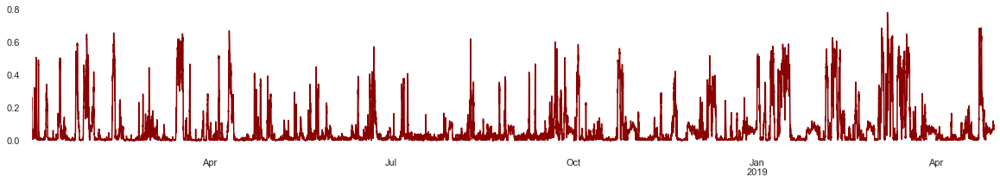
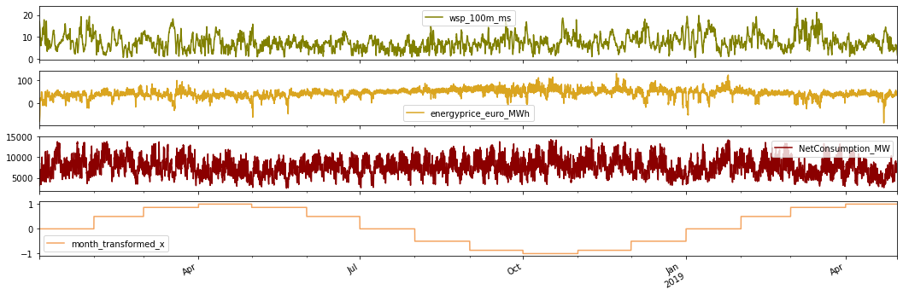
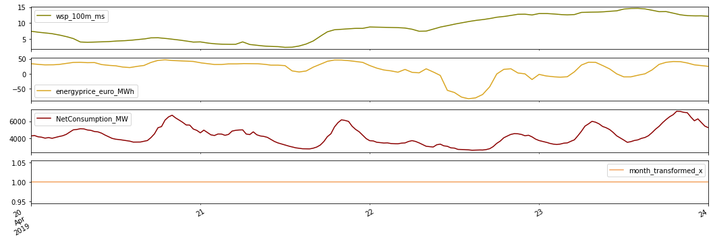
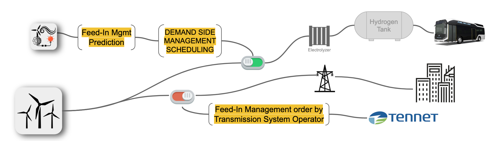
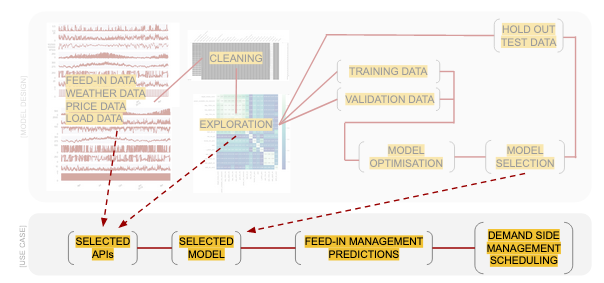
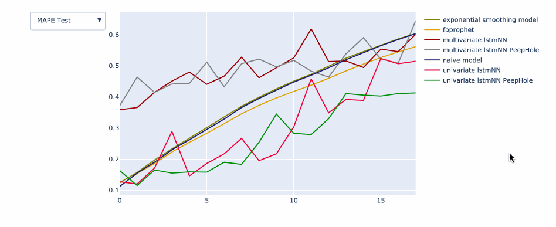
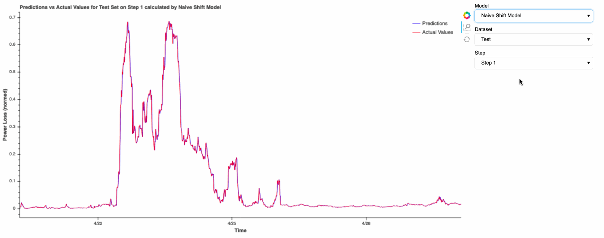

# Prediction of Renewable Power Loss caused by Feed-in Management Events

Final project at the Data Science Bootcamp **[@neuefische](www.neuefische.de)**. This project has been developed in 4 weeks in the fall of 2020 by Tjade Appel ([LinkedIn](www.linkedin.com/in/tjade-appel) / [GitHub](https://github.com/tjade27)) and Jonas Jaenicke ([LinkedIn](www.linkedin.com/in/jonasjaenicke) / [GitHub](https://github.com/JonJae)). Please feel free to contact us.  

## Business Context: keeping the energy grid stable

The term feed-in management refers to the curtailment of power that is fed into the power grid in dependence of the power that is actually used by connected consumers or is being transferred on to other grid areas. Both, the available and the consumed power, need to be in a perfect balance for every 15 minute interval to ensure grid stability. Against this background, especially renewable energy systems like wind turbines pose a big challenge, since by default the power from these systems is very volatile. To protect grid infastructure (e.g., overhead lines or transformers) from overload, a curtailment of energy production takes place - so called feed-in management.

In the context of the so-called smart grid, the intelligent management of electricity demand, also referred to as demand side management (DSM), has been recognized as an effective approach to increase the use of renewable energy using energy that would otherwise potentially be curtailed in an feed-in managment event. In order to schedule Demand Side Managment applications, a prediction of feed-in managment events is needed. 

## Goal: Prediction of Wind Energy Curtailment

The result of this project is a deep learning model that predicts lost power for the next control interval(s) in dependence of various parameters in the past. This is useful for energy traders, grid operators as well as consumers who participate in Demand-Side-Managment. 

## Repo Organisation

- [FeedInMngmt_Presentation.pdf](FeedInMngmt_Presentation.pdf): Presentation of the project including additional explanation about the feed-in managment sitatuion. (to be uploaded)
- [FeedInMngmt_EDA.ipynb](FeedInMngmt_EDA.ipynb): Loading and pre-processing feed-in managment data as well as weather data, price data and energy consumption data. Followed by an exploration of the given data as well as an investigation of correlating behavior of various time series (e.g., the influence of wind on feed in management events). This document ends with a ranking and selection of features by their importance.  
- [FeedInMngmt_Base_Models.ipynb](FeedInMngmt_Base_Models.ipynb): Creation and elaboration of train-validation-test split as well as design of two naive baseline models: the Shift model (e.g., the next timestep equals the last time step) and an  Exponential Smoothing model (e.g., next timestep equals the moving average over the last X hours). In addition, functions to evaluate the test results are described in this document.  
- [FeedInMngmt_Prophet.ipynb](FeedInMngmt_Prophet.ipynb): Implementation and evaluation of a FB Prophet Model for the prediction of one timestep and multiple timesteps into the future. 
- [FeedInMngmt_LSTM_NN.ipynb](FeedInMngmt_LSTM_NN.ipynb): Implementation and evaluation of a Long-Short-Term-Memory Recurrent Neural Network for the prediction of one timestep and multiple timesteps into the future. 
- [FeedInMngmt_Results.ipynb](FeedInMngmt_Results.ipynb): Evaluation of the different models based on the chosen test metrics. 

## Data Overview

The aim of this Data Science projekt is a to predict Feed-In Managment events and the energy loss connected to these events. After cleaning, all data is available and consitent for the follwoing timespan:  `2018-01-01 06:00:00` until `2019-04-30 06:00:00`. 
The  target data (`target_losses_norm`) for this timespan looks as followed. 

In addition to the target data (endogenous variable), various exogenous features are given. Meteorological parameters are obtained from a  numerical weather model (GFS data, e.g., `t_100m_k` as temperuter at 100m above ground). Furthermore, predictions are based on price data (e.g., `energyprice_euro_MWh`), energy consumption data (`NetConsumption_MW`) and engineered features (such as `working_day`). 

In the  following graphs various exogenous features are shown in their variation over time. 

A detailed view for the same features below. 

##  Use Case overview

The developed model can potentially be used as part of a Demand Side Managment scheduling software. The following visualisation describes the usecase for schedualed hydrogen production. The hydrogen can then be used to power a fuel cell bus. 

## Approach to model design and model integration

## Outcome

The performances of the investigated prediction models are measured using the Mean Absolute Percentage Error (MAPE), [static plot here](./figures/results_MAPE_test.png). The univariate LSTM neural network with peephole connections delivered the smallest mean absolute percentage error and was able to beat the chosen base models for all but the very first time step.

An interactive visualisation of the predictions can be started through the results notebook and is demonstrated below. Static view for [`LSTM univariate 10 Steps`](https://github.com/JonJae/FeedInMngmt_prediction/blob/main/figures/vis_prediction_uni_10steps.png) [`LSTM univariate 18 Steps`](https://github.com/JonJae/FeedInMngmt_prediction/blob/main/figures/vis_prediction_uni_18steps.png) [`LSTM multivariate 10 Steps`](https://github.com/JonJae/FeedInMngmt_prediction/blob/main/figures/vis_prediction_multi_10steps.png) [`LSTM multivariate 18 Steps`](https://github.com/JonJae/FeedInMngmt_prediction/blob/main/figures/vis_prediction_multi_18steps.png)

## Future Work

**APIs for live predictions:** For live predictions of Feed-In Management loss, GFS Data, Feed-In  Management Data as well as Price and Consumption data need to be recieved via an application programming interface (API).  Services to consider include [eex Market API](https://www.eex.com/en/market-data/eex-group-datasource/api), [SMARD Strommarktdaten](https://www.smard.de/en/downloadcenter/download-market-data), [OpenWeather API](https://openweathermap.org/api), [climacell Weather Data](https://www.climacell.co/). 

**Interpolation of inconsistent / artificial data April/Mai 2019:** In the Exploratory Data Analysis, inconsistent / artificial data was observered for parts of April/Mai 2019. In the current approach, the data was cut of at `2019-04-30 06:00:00` to avoide the model  being trained on artificial data. A interpolation of the data gap could  be done using a Standard Week or even a SARIMA model for the seasonal data (e.g., azimuth and elevation).
