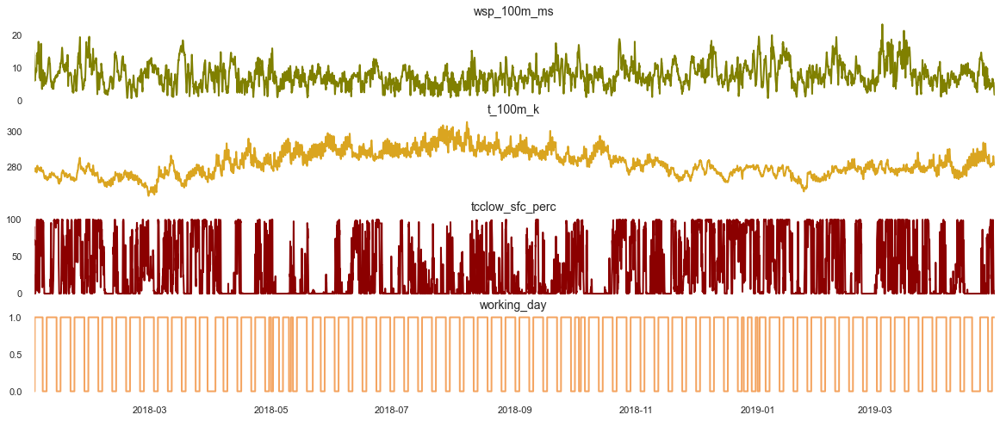

# Quadra - Prediction of Renewable Power Loss caused by Feed-in Management Events

 
 

## Business Context

The term feed-in management refers to the curtailment of power that is fed into the power grid (‘available power’) (‘available power’) in dependence of the power that is actually used by connected consumers or is being transferred on to other grid areas (‘consumed power’). Both of these values need to be in a perfect balance for every 15 minute interval to ensure grid stability. Against this background, especially renewable energy systems like wind turbines pose a big challenge, since by default by default the power from these systems is very volatile. 

## Goal

In this project, we will try to create a time series model that predictss the lost power for the next control interval(s) in dependence of parameters in the past. This might be useful for energy traders as well as the people in charge of guaranteeing grid stability.

## Data Overview

The aim of this Data Science projekt is a to predict Feed-In Managment events and the energy loss connected to these events. After cleaning, all data is available and consitent for the follwoing timespan:  `2018-01-01 06:00:00` until `2019-04-30 06:00:00`. 
The  target data (`target_losses_norm`) for this timespan looks as followed. 

In addition to the target data (endogenous variable), various meteorological parameters obtained from a  numerical weather model (GFS data, e.g., `t_100m_k`) are given (exogenous variables). In the  following graphs example Exogenous Features are shown in their variation over time. 

