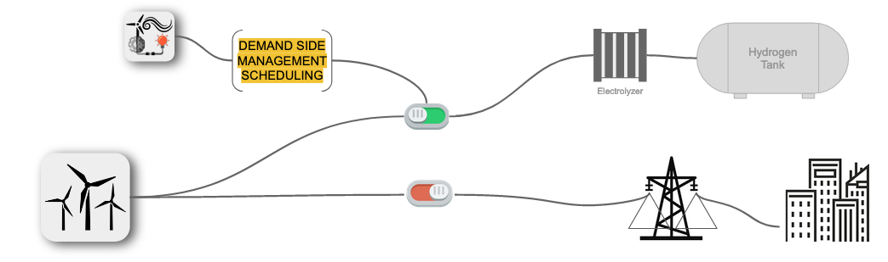
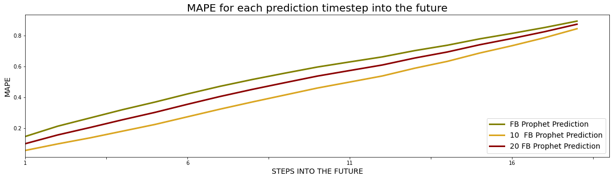

# Quadra - Prediction of Renewable Power Loss caused by Feed-in Management Events

Final project at the Data Science Bootcamp **[@neuefische](www.neuefische.de)**. This project has been developed in 4 weeks in the fall of 2020 by Tjade Appel ([LinkedIn](www.linkedin.com/in/tjade-appel) / [GitHub](https://github.com/tjade27)) and Jonas Jaenicke ([LinkedIn](www.linkedin.com/in/jonasjaenicke) / [GitHub](https://github.com/JonJae)). Please feel free to contact us.  

## Business Context: keeping the energy grid stable

The term feed-in management refers to the curtailment of power that is fed into the power grid in dependence of the power that is actually used by connected consumers or is being transferred on to other grid areas. Both, the available and the consumed power, need to be in a perfect balance for every 15 minute interval to ensure grid stability. Against this background, especially renewable energy systems like wind turbines pose a big challenge, since by default the power from these systems is very volatile. To protect grid infastructure (e.g., overhead lines or transformers) from overload, a curtailment of energy production takes place - so called feed-in management.

In the context of the so-called smart grid, the intelligent management of electricity demand, also referred to as demand side management (DSM), has been recognized as an effective approach to increase the use of renewable energy using energy that would otherwise potentially be curtailed in an feed-in managment event. In order to schedule Demand Side Managment applications, a prediction of feed-in managment events is needed. 

## Goal: Prediction of Wind Energy Curtailment

The result of this project is a deep learning model that predicts lost power for the next control interval(s) in dependence of various parameters in the past. This is useful for energy traders, grid operators as well as consumers who participate in Demand-Side-Managment. 

## Repo Organisation

- [FeedInMngmt_presentation.pdf](FeedInMngmt_LSTM.ipynb): Presentation of the project including additional explenation about the feed-in managment sitatuion. 
- [FeedInMngmt_EDA.ipynb](FeedInMngmt_EDA.ipynb): Loading and pre-processing feed-in managment data as well as weather data, price data and energy consumption data. Followed by an exploration of the given Data as well as an investigation of correlating behaivoir of various time series (e.g., the influence of wind on feed in management events). This document ends with a ranking and selection of features by their importance.  
- [FeedInMngmt_ML.ipynb](FeedInMngmt_ML.ipynb): Creation and elaboration of train-validation-test split as well as design of two Naïve base-line models: the shift model (e.g., the next timestep equals the last time step ) and an  Exponential Smoothing model (e.g., next timestep equals the moving average over the last X hours). In addition, functions to evaluate the the results are described in this document.  
- [FeedInMngmt_Prophet.ipynb](FeedInMngmt_Prophet.ipynb): Implementation, tuning and evaluation of a FB Prophet Model for for prediction of one timestep and multiple timesteps into the future. 
- [FeedInMngmt_LSTM.ipynb](FeedInMngmt_LSTM.ipynb): Implementation, tuning and evaluation of a Long-Short-Term-Memory Recurrent Neural Network for prediction of one timestep and multiple timesteps into the future. 

## Data Overview

The aim of this Data Science projekt is a to predict Feed-In Managment events and the energy loss connected to these events. After cleaning, all data is available and consitent for the follwoing timespan:  `2018-01-01 06:00:00` until `2019-04-30 06:00:00`. 
The  target data (`target_losses_norm`) for this timespan looks as followed. 

In addition to the target data (endogenous variable), various exogenous features are given. Meteorological parameters are obtained from a  numerical weather model (GFS data, e.g., `t_100m_k` as temperuter at 100m above ground). Furthermore, predictions are based on price data (e.g., `energyprice_euro_MWh`), energy consumption data (`NetConsumption_MW`) and engineered features (such as `working_day`). 

In the  following graphs various exogenous features are shown in their variation over time. 

A detailed view for the same features below. 

##  Use Case overview

The developed model can potentially be used as part of a Demand Side Managment scheduling software. The following visualisation describes the usecase for schedualed hydrogen production. 

## Approach to model design

## Performance of the models

The performance of the investigated prediction models are measured using the Mean Average Percentage Error (MAPE). Based on this metric, an LSTM is the best performing model.  

